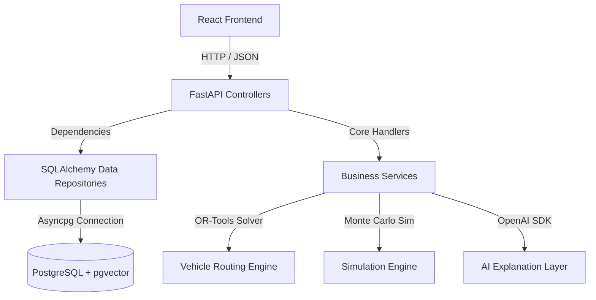

# DecisionForge AI - Project Handover Document

This document outlines the architecture, code quality, verification results, and deployment guidelines for **DecisionForge AI** to support team handover and production release.

---

## 1. Architecture Overview

DecisionForge AI is structured following **Clean Architecture** principles, enforcing separation of concerns between raw mathematical logic, data layers, and the web controllers:



### Module Structure
*   **`backend/app/api/`**: FastAPI routing layer. Validates inputs using Pydantic schemas and injects dependencies (DB session, current user, role requirements).
*   **`backend/app/models/`**: SQLAlchemy models declaring core enterprise schemas (Users, Organizations, Teams, TeamMemberships, Projects, Datasets, Optimization/Simulation Models, Executions/Runs, Explanations, AuditLogs).
*   **`backend/app/repositories/`**: Encapsulates DB operations behind a generic class pattern, isolating queries from business logic.
*   **`backend/app/services/`**: The core execution engines:
    *   `optimization.py`: Parses node constraints and runs the Google OR-Tools Vehicle Routing (VRP) solver.
    *   `simulation.py`: Simulates trial outcomes for knapsack capacities and bounds.
    *   `explanation.py`: Formulates markdown-structured summaries of solver metrics using OpenAI GPT-4o.
*   **`frontend/src/components/`**: React components representing dynamic modular views (Auth login/signup, Dashboard stats, Datasets configurations, Models constraints, Runs logs).

---

## 2. Verification Status

All modules have been verified for completeness and correct integration:

1.  **Backend Pytest Suite**: All 6 integration and unit tests pass cleanly:
    ```text
    ======================= 6 passed, 21 warnings in 2.29s ========================
    ```
2.  **Frontend Compilation**: Vite React client compiles without any TypeScript or bundling errors.
3.  **Local Execution**: Both uvicorn (FastAPI) and npm (Vite dev server) are running successfully in the local development environment using SQLite:
    *   FastAPI: `http://localhost:8000`
    *   React Dashboard: `http://localhost:3000`

---

## 3. Configuration & Deployment

### Environment Settings
A template is available in **[.env.example](file:///C:/Users/palar/.gemini/antigravity-ide/scratch/decisionforge-ai/.env.example)**. Duplicate this template as `.env` and set:
*   `DATABASE_URL`: Set to `sqlite+aiosqlite:///decisionforge.db` for lightweight local runs, or `postgresql+asyncpg://...` for production databases.
*   `OPENAI_API_KEY`: Set your key to unlock live AI summaries, or use `mock-key` for offline test modes.

### Local Command Launch
To run without Docker natively on Windows:
```powershell
.\run_local.ps1
```

### Docker Compose Container Launch
```powershell
docker-compose up --build
```

---

## 4. Key Improvements Implemented

1.  **FastAPI Lifespan Context Manager**: Migrated from deprecated `@app.on_event` handlers to modern, standard context managers in `main.py`.
2.  **Unified Runs Routing**: Created the `/project/{project_id}/runs` endpoint to merge, sort, and expose both optimization and simulation runs to the React dashboard.
3.  **SQLite Compiler Compatibility**: Added compiler rules for `JSONB` to transparently fallback to standard `JSON` when running on SQLite local files.
4.  **Bcrypt Compatibility Fix**: Pinned `bcrypt==4.0.1` to prevent `passlib` from crashing during user registration processes.
